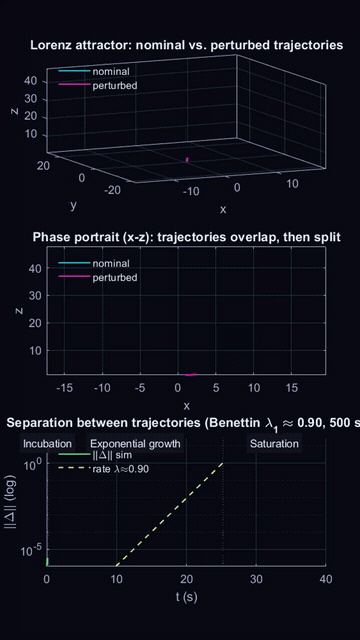

# Lorenz Attractor: Simulating Deterministic Chaos with Lyapunov Spectrum

## Overview

This repository demonstrates **deterministic chaos** in the Lorenz (1963) system using Simulink and MATLAB. A single entry-point script — `src/simulate_lorenz_chaos.m` — builds the Simulink model, runs it twice with a $10^{-6}$ perturbation, computes the full Lyapunov spectrum via the Benettin method, and produces an animated three-panel visualization. The computed $\lambda_1 \approx 0.905$ (literature: 0.9056) confirms the system's chaotic nature.

## Scientific Context

Chaotic systems exhibit sensitive dependence on initial conditions: tiny perturbations grow exponentially, making long-term prediction impossible despite deterministic equations. The Lorenz system (derived from simplified convection equations) is the archetype. Ed Lorenz's 1963 paper established that deterministic rules can produce bounded, non-repeating, unpredictable behavior.

The **Lyapunov exponents** measure this sensitivity. They quantifiably capture average exponential divergence ($\lambda > 0$) or convergence ($\lambda < 0$) in phase space. The Lorenz spectrum at $(\sigma,\rho,\beta)=(10,28,8/3)$ is approximately $[0.9056,\;0,\;-14.572]$: one positive exponent proves chaos, one zero reflects the neutral flow direction, and one negative reflects phase-space contraction.

The **Benettin method** (Benettin et al., 1980) computes the full spectrum by integrating the 3D orbit alongside its 3×3 variational equations (12-state ODE). Every $dT=0.5$ s the tangent basis is reorthonormalized by Modified Gram–Schmidt thin QR (`[Q,R]=gram_schmidt(V)`, `diag(R)>0` via `DNRM2` scaling — generalized `M×N`, stable `‖Q'Q-I‖=O(eps·κ)`); the log of each diagonal entry divided by `dT` gives one sample per exponent (`log(diag(R))/dT`). After discarding the first 25% of samples (transient), the remaining are averaged. For these parameters: $\lambda_1=0.905$, $\lambda_2\approx0$, $\lambda_3=-14.568$, with $\sum\lambda_i=-13.667=-(\sigma+1+\beta)$ which is a precise trace check matching the theory.

## Repository Structure

```
simulink_lorenz/
├── src/
│   ├── simulate_lorenz_chaos.m          # Entry point (dual sim + Lyapunov + animation)
│   ├── build/
│   │   ├── build_lorenz_sim.m           # Generates models/lorenz_sim.slx
│   │   └── decorate_lorenz_sim.m         # Block colors + TeX annotations
│   ├── analysis/
│   │   ├── lorenz_lyapunov_spectrum.m    # Benettin loop (delegates QR to gram_schmidt)
│   │   └── gram_schmidt.m                # Modified Gram-Schmidt thin QR (M×N, diag>0)
│   └── visualization/
│       └── plot_lorenz_attractor.m       # Rotating 3D attractor (model StopFcn)
├── models/
│   └── lorenz_sim.slx                    # Built Simulink model (generated by build script)
├── docs/
│   ├── lorenz_chaos_paper.mlx / .pdf    # Companion paper
│   └── Benettin_method.pdf  # *(to be completed)*
├── media/
│   ├── lorenz_chaos_reel.mp4             # 9:16 animated reel (~12 s, release asset)
│   └── lorenz_chaos_reel.gif             # preview GIF (360×640, 4.1 MB, auto-plays in README)
```

## What's in the Paper

The companion document (`docs/lorenz_chaos_paper.pdf`) walks through:

1. The Lorenz equations and the chaotic parameter set $(\sigma,\rho,\beta)=(10,28,8/3)$
2. The Simulink model: 12 blocks (3 integrators, 3 sums, 2 gains, 2 products, 1 constant, 3 sinks), fixed-step RK4 (`ode4`, 0.001 s)
3. Dual-trajectory animation: nominal vs perturbed runs, 3D attractor, $xz$-phase space, log-scale separation
4. Lyapunov spectrum derivation, Benettin integration, Gram–Schmidt reorthonormalization, and convergence verification
5. Results table confirming the trace check and $\lambda_1 \approx 0.905$

<p align="center">
  <a href="https://github.com/jblanco89/lorenz_attractor_analysis_simulink/releases/latest/download/lorenz_chaos_reel.mp4">
    
  </a>
</p>

<p align="center">
  <em>📹 Animated chaos study — click GIF for full-res MP4 (9:16, 1080×1920, ~12 s, 14.5 MB) — <a href="https://github.com/jblanco89/lorenz_attractor_analysis_simulink/releases/latest/download/lorenz_chaos_reel.mp4">direct download</a> • preview auto-plays (no upload via Issues needed)</em>
</p>

For the mathematical derivation of the **Benettin method**, see **[docs/Benettin_method.pdf](docs/Benettin_method.pdf)**.

## Prerequisites

| Requirement | Notes |
|---|---|
| MATLAB | R2024a (R2023b+ likely compatible) |
| Simulink | Included with MATLAB |
| Optimization Toolbox (optional) | Required for tight ODE tolerances (`AbsTol 1e-10`, `RelTol 1e-11`) |

No additional toolboxes are required.

## How to Use

### Clone and Set Up

```matlab
cd simulink_lorenz
addpath(genpath(pwd))   % adds src/, models/, docs/ to MATLAB path
```

Or use MATLAB's **Set Path → Add with Subfolders** on the repository root.

### Run the Study

```matlab
simulate_lorenz_chaos          % answer 'n' at the prompt → on-screen animation
simulate_lorenz_chaos          % answer 'y'               → records MP4 to media/
```

### What the Script Does

1. Runs `lorenz_sim` twice: nominal ($x_0=1$) and perturbed ($x_0=1+10^{-6}$) for $T=40$ s
2. Resamples both trajectories onto a common 5000-point grid
3. Computes the full Lyapunov spectrum via `lorenz_lyapunov_spectrum()`
4. Animates three panels: 3D attractor (rotating), $xz$-phase portrait, $\log\|\Delta\|(t)$
5. Optionally captures a 1080×1920 portrait MP4 at 30 fps → `media/lorenz_chaos_reel.mp4`
6. Restores the model to `StopTime=100`, `StopFcn=plot_lorenz_attractor`, `x0=1`

### Compute the Spectrum Standalone

```matlab
lambda = lorenz_lyapunov_spectrum   % returns [λ1; λ2; λ3], silent
```

### Expected Output

```
Simulating: nominal (x0=1) and perturbed (x0=1+1e-06) ...
+-----------------------------------------------+
| Quantity                      |         Value |
+-----------------------------------------------+
| Initial distance              |     1.000e-06 |
| Final distance                |         9.335 |
| lambda_1 (Benettin)           |         0.905 |
| lambda_2 (Benettin)           |        -0.002 |
| lambda_3 (Benettin)           |       -14.568 |
| sum lambda (trace check)      |       -13.666 |
+-----------------------------------------------+
```

## To-Do List

### Done

- [x] Hybrid Simulink + MATLAB replication of Lara et al. (2003) in `lara-lyapunov-2003/` (eigenvalue-averaged spectrum, `r=20…30` sweep at full `tf=10000` fidelity, divergence control `-13.666`, `FixedPoint`/`Strange` classification)
- [x] Pure-MATLAB CPU benchmark vs Gram–Schmidt (`m=2…20`, growing speedup trend as in Table 1)
- [x] Gram–Schmidt cross-check on subset `[23 24 25 28]` with the existing Benettin implementation
- [x] Scientific `.mlx` report (`lara-lyapunov-2003/doc/`) with equations, code cell, and figures regenerated from the FULL sweep
- [x] Removed tracked Simulink `.autosave` and added `*.autosave` to `.gitignore`

### Pending

- [ ] Improve the wording of the Lara et al. (2003) `.mlx` report (scientific Spanish prose, captions, and conclusions)
- [ ] Improve the wording of the `lara-lyapunov-2003/README.md` (coverage table, decisions, and verification sections)
- [ ] Extend the Gram–Schmidt cross-check from the `[23 24 25 28]` subset to the full `r=20…30` range (or parameterize `Tben`) to complete Table 2
- [ ] Re-run the `r=24` Benettin check at long horizon — the short `Tben=500` run misclassifies near the bifurcation (critical slowing down)
- [ ] Add the analytic eigenvalue branch for orders `m≤4` and benchmark analytic vs numeric (the paper's extra saving)
- [ ] Add the no-simulation didactic examples from Sec. 3 (Schrödinger forbidden region, Duffing `k,β<0` no-chaos proof)
- [ ] Validate the fixed-step `ode4` orbits against variable-step `ode45` to quantify solver drift
- [ ] Overlay the Benettin `λ₁(t)` curve on Fig. 2 for a direct convergence comparison
- [ ] Extract `lara-lyapunov-2003/core/` as a standalone toolbox with `matlab.unittest` tests
- [ ] Decide the versioning policy for `lara-lyapunov-2003/results/` artifacts (`.mat`/`.png`: track, Git LFS, or ignore and regenerate)

